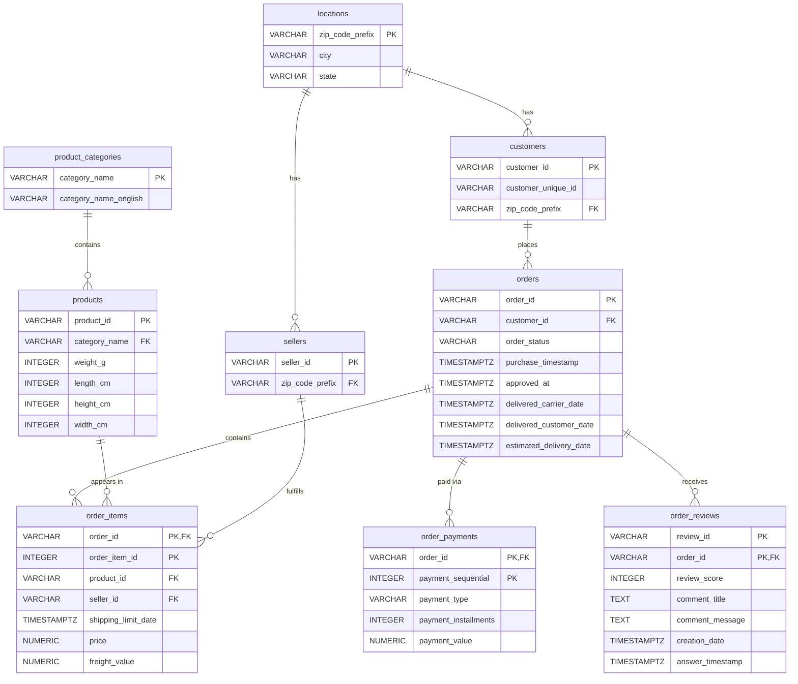

# ERD (Entity-Relationship Diagram) – Crow's Foot Notation

## Visual ERD (Renders automatically on GitHub)



## Overall Data Model

This diagram represents the complete Olist e-commerce database schema. The model is hierarchically organized around orders as the central transaction entity, with supporting master tables for locations, products, categories, customers, and sellers.

---

## Entity Definitions & Attributes

### 1. **locations**
- **Primary Key:** `zip_code_prefix` (VARCHAR(10))
- **Other Attributes:** `city` (VARCHAR(100)), `state` (VARCHAR(2))
- **Purpose:** Master table for geographic/postal code data. Used by both customers and sellers to normalize location information and eliminate redundancy.
- **Cardinality:** One location can have many customers and many sellers.

### 2. **product_categories**
- **Primary Key:** `category_name` (VARCHAR(100))
- **Other Attributes:** `category_name_english` (VARCHAR(100), nullable)
- **Purpose:** Master table for product categories. Normalizes all product-to-category mappings and provides English translations for easier analysis.
- **Cardinality:** One category can have many products.

### 3. **customers**
- **Primary Key:** `customer_id` (VARCHAR(50))
- **Other Attributes:** `customer_unique_id` (VARCHAR(50)), `zip_code_prefix` (FK → locations)
- **Purpose:** Holds unique customer records with their location. Customer_unique_id identifies repeat customers across multiple orders.
- **Cardinality:** One customer can have many orders; one location can have many customers.

### 4. **sellers**
- **Primary Key:** `seller_id` (VARCHAR(50))
- **Other Attributes:** `zip_code_prefix` (FK → locations)
- **Purpose:** Registry of all sellers with their location information.
- **Cardinality:** One seller can fulfill many order items; one location can have many sellers.

### 5. **products**
- **Primary Key:** `product_id` (VARCHAR(50))
- **Other Attributes:** `category_name` (FK → product_categories), `weight_g` (INTEGER), `length_cm` (INTEGER), `height_cm` (INTEGER), `width_cm` (INTEGER)
- **Purpose:** Master product catalog with physical dimensions for shipping calculations.
- **Cardinality:** One product can appear in many order items; one category can have many products.

### 6. **orders**
- **Primary Key:** `order_id` (VARCHAR(50))
- **Other Attributes:** `customer_id` (FK → customers), `order_status` (VARCHAR(20)), `purchase_timestamp` (TIMESTAMPTZ), `approved_at` (TIMESTAMPTZ), `delivered_carrier_date` (TIMESTAMPTZ), `delivered_customer_date` (TIMESTAMPTZ), `estimated_delivery_date` (TIMESTAMPTZ)
- **Purpose:** Core transaction table tracking order lifecycle status and timestamps.
- **Cardinality:** One order belongs to one customer; one order can have many items, payments, and reviews.

### 7. **order_items** (Bridge/Fact Table)
- **Primary Key:** Composite (`order_id`, `order_item_id`) (VARCHAR(50), INTEGER)
- **Other Attributes:** `product_id` (FK → products), `seller_id` (FK → sellers), `shipping_limit_date` (TIMESTAMPTZ), `price` (NUMERIC(10,2)), `freight_value` (NUMERIC(10,2))
- **Purpose:** Resolves many-to-many relationship between orders and products. Each item is unique within an order but one order can have multiple items from different sellers.
- **Cardinality:** One order can have many items; one product can appear in many order items; one seller can fulfill many items.

### 8. **order_payments**
- **Primary Key:** Composite (`order_id`, `payment_sequential`) (VARCHAR(50), INTEGER)
- **Other Attributes:** `payment_type` (VARCHAR(20)), `payment_installments` (INTEGER), `payment_value` (NUMERIC(10,2))
- **Purpose:** Models variable payment methods and installment plans for a single order. One order can be paid via multiple payment records.
- **Cardinality:** One order can have many payment records.

### 9. **order_reviews**
- **Primary Key:** Composite (`review_id`, `order_id`) (VARCHAR(50), VARCHAR(50))
- **Other Attributes:** `review_score` (INTEGER), `comment_title` (TEXT), `comment_message` (TEXT), `creation_date` (TIMESTAMPTZ), `answer_timestamp` (TIMESTAMPTZ)
- **Purpose:** Customer feedback and seller responses on completed orders.
- **Cardinality:** One order can have one (or potentially multiple) reviews; one review belongs to one order.

---

## Crow's Foot Relationship Notation

```
locations (1) ────────────────┬────────────────────── (Many) customers
                              │
                              └────────────────────── (Many) sellers

product_categories (1) ──────────────────────────── (Many) products

customers (1) ────────────────────────────────── (Many) orders

orders (1) ┬──────────────────────────────────── (Many) order_items
           ├──────────────────────────────────── (Many) order_payments
           └──────────────────────────────────── (Many) order_reviews

products (1) ──────────────────────────────────── (Many) order_items

sellers (1) ───────────────────────────────────── (Many) order_items
```

---

## Relationship Descriptions

| From | To | Relationship | Cardinality | Description |
|------|---|---|---|---|
| locations | customers | FK (zip_code_prefix) | 1-to-Many | Each location can have multiple customers; each customer belongs to one location. |
| locations | sellers | FK (zip_code_prefix) | 1-to-Many | Each location can have multiple sellers; each seller belongs to one location. |
| product_categories | products | FK (category_name) | 1-to-Many | Each category contains multiple products; each product belongs to one category. |
| customers | orders | FK (customer_id) | 1-to-Many | Each customer can place multiple orders; each order belongs to one customer. |
| orders | order_items | FK (order_id) | 1-to-Many | Each order contains multiple items; each item belongs to one order. |
| products | order_items | FK (product_id) | 1-to-Many | Each product can appear in many order items; each item references one product. |
| sellers | order_items | FK (seller_id) | 1-to-Many | Each seller can fulfill many order items; each item is fulfilled by one seller. |
| orders | order_payments | FK (order_id) | 1-to-Many | Each order can have multiple payment records; each payment belongs to one order. |
| orders | order_reviews | FK (order_id) | 1-to-Many | Each order can have multiple reviews; each review belongs to one order. |

---

## Design Rationale

### Master-Detail Pattern
- **Master tables** (`locations`, `product_categories`, `customers`, `sellers`, `products`, `orders`) define entities with unique identities.
- **Detail tables** (`order_items`, `order_payments`, `order_reviews`) define transactions or child records tied to a master.

### Many-to-Many Resolution
- **orders ↔ products:** Initially many-to-many (one order has many products, one product can be in many orders). Resolved via **order_items** (associative/junction table).
- Each `order_item` record represents a unique product in a unique order, sold by a specific seller with its own price and shipping cost.

### Temporal Tracking
- Timestamps (`TIMESTAMPTZ`) track order lifecycle: purchase → approval → carrier delivery → customer delivery.
- `estimated_delivery_date` supports SLA tracking.
- `creation_date` and `answer_timestamp` in reviews track customer → seller feedback timeline.

### Currency & Measurement
- All monetary fields use `NUMERIC(10,2)` to preserve precision for financial calculations.
- Physical dimensions use `INTEGER` (centimeters and grams) for shipping logistics.

---

## Constraints & Integrity Rules

- **Primary Keys:** All entities have explicit, unique identifiers (single or composite).
- **Foreign Keys:** All detail records reference valid master records with no orphans allowed.
- **NOT NULL:** Required fields (status, timestamps, prices) cannot be null; optional feedback fields (comment_title, comment_message, review_answer_timestamp) can be null.
- **CHECK:** Constraints enforce business rules (e.g., `price >= 0`, `review_score BETWEEN 1 AND 5`, `weight_g >= 0`).

This design ensures data integrity, eliminates redundancy, and supports efficient querying across the e-commerce transaction lifecycle.
