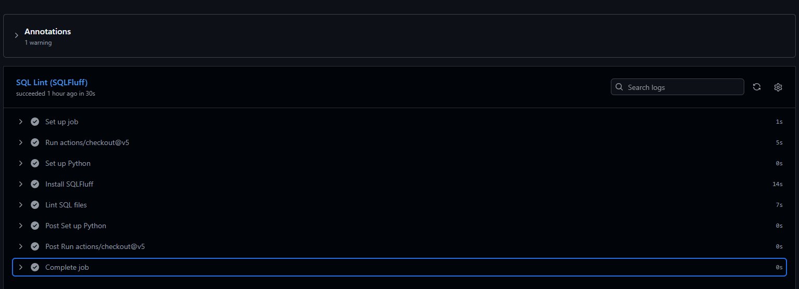
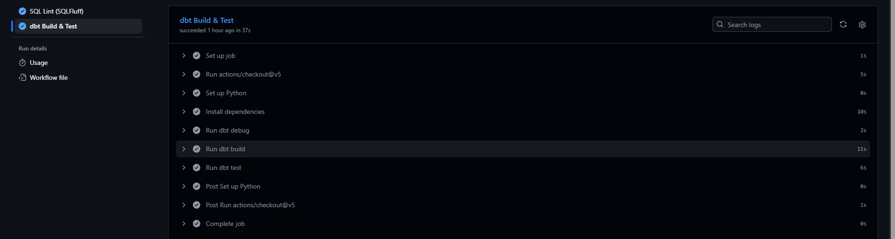
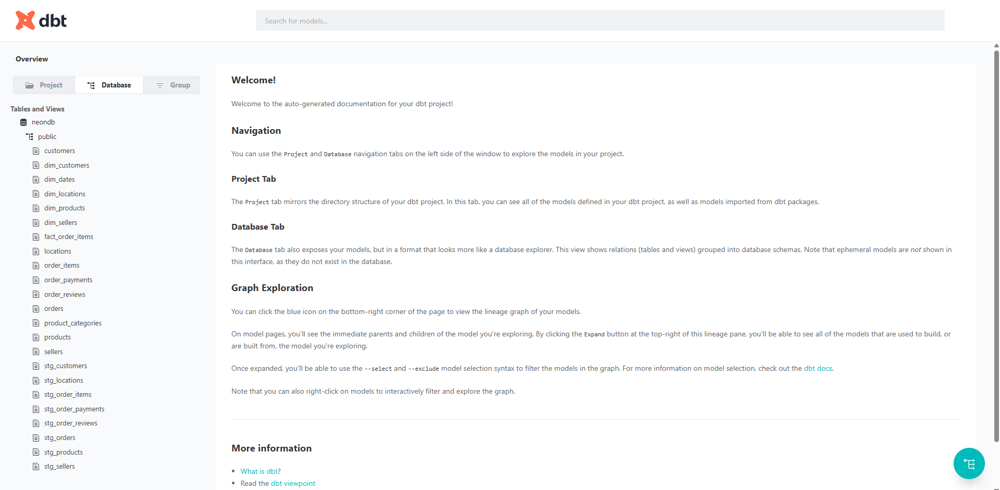

# 📊 Phase 2 — Milestone Check-in

Demonstration that all Phase 2 deliverables are working end-to-end: **dbt transformations**, **data quality tests**, **CI/CD linting**, and **advanced analytical queries**.

---

## 🎯 Summary at a Glance

| Check | Result |
|:---|:---:|
| 🔵 dbt models built | **14** (8 staging + 5 dims + 1 fact) |
| ✅ dbt tests passing | **26 / 26** |
| 🏗️ dbt build total | **40 / 40** (models + tests) |
| 🧹 SQLFluff lint | **Passing** |
| ⚙️ GitHub Actions CI | **Both jobs green** |
| 🔍 Analytical queries | **3 / 3 working** |

---

## 1️⃣ CI/CD Pipeline — GitHub Actions

Both CI jobs run automatically on every pull request to `main`. Both pass.

### SQL Lint (SQLFluff)


### dbt Build & Test


---

## 2️⃣ dbt Tests — 26 / 26 Passing

Data quality enforced through a mix of:
- **`not_null`** on primary keys and critical fields
- **`unique`** on all dimension primary keys
- **`relationships`** for referential integrity between fact and dimensions
- **`accepted_values`** on categorical fields (`order_status`)

### Final Output
```
Finished running 26 data tests in 0 hours 0 minutes and 12.13 seconds (12.13s).
Completed successfully
Done. PASS=26 WARN=0 ERROR=0 SKIP=0 NO-OP=0 TOTAL=26
```

📄 Full log: [`dbt_test_output.txt`](./dbt_test_output.txt)

---

## 3️⃣ dbt Build — 40 / 40 Passing

Full end-to-end run: builds every model and runs every test in one command.

### Final Output
```
Finished running 6 table models, 26 data tests, 8 view models in 0 hours 0 minutes and 17.19 seconds (17.19s).
Completed successfully
Done. PASS=40 WARN=0 ERROR=0 SKIP=0 NO-OP=0 TOTAL=40
```

📄 Full log: [`dbt_build_output.txt`](./dbt_build_output.txt)

---

## 4️⃣ dbt Data Catalog

Auto-generated documentation browsable via `dbt docs serve`. Shows every model, column descriptions, sources, and lineage graph.



> 💡 To view live: `cd olist_dbt && dbt docs serve --profiles-dir .`

---

## 5️⃣ Advanced Analytical Queries

Three complex SQL queries using **CTEs**, **window functions**, and aggregations. Full results in [`analytical_queries_output.txt`](./analytical_queries_output.txt).

### 🎯 Query 1 — RFM Customer Segmentation
Uses `NTILE(4)` window functions to score customers on Recency, Frequency, and Monetary dimensions.

| Customer Segment | Count | Avg Recency (days) | Avg Spend ($) |
|:---|---:|---:|---:|
| Champions | 23,531 | 159.7 | 267.67 |
| At Risk | 22,848 | 412.1 | 266.96 |
| Potential Loyalists | 314 | 170.1 | 138.00 |
| Loyal Customers | 11,559 | 159.3 | 82.93 |
| Others | 29,111 | 296.4 | 60.02 |
| Lost | 5,995 | 502.5 | 45.48 |

### 🏆 Query 2 — Seller Performance Dashboard
Uses `RANK()`, `PERCENT_RANK()`, and rolling window averages. Top 5 sellers by revenue:

| Rank | Seller | City | State | Revenue ($) | Avg Review |
|:---:|:---|:---|:---:|---:|:---:|
| 1 | 4869f7a5... | Guariba | SP | 226,987.93 | 4.14 ⭐ |
| 2 | 53243585... | Lauro de Freitas | BA | 217,940.44 | 4.13 ⭐ |
| 3 | 4a3ca931... | Ibitinga | SP | 199,408.32 | 3.83 ⭐ |
| 4 | fa1c13f2... | Sumaré | SP | 190,917.14 | 4.37 ⭐ |
| 5 | 7c67e144... | Itaquaquecetuba | SP | 188,063.83 | 3.35 ⭐ |

### 📈 Query 3 — Monthly Cohort Retention
Uses `LAG()` and `ROW_NUMBER()` window functions to track customer retention by acquisition cohort.
Returns **188 rows** of cohort × month retention data (first 13 months of each cohort).

---

## 📁 Files in This Folder

| File | Description |
|:---|:---|
| `README.md` | This report |
| `ci_sqlfluff_pass.png` | GitHub Actions: SQL Lint job success |
| `ci_dbt_build_pass.png` | GitHub Actions: dbt Build & Test job success |
| `dbt_docs_catalog.png` | dbt docs browser view (data catalog) |
| `dbt_test_output.txt` | Full `dbt test` log (26/26 pass) |
| `dbt_build_output.txt` | Full `dbt build` log (40/40 pass) |
| `analytical_queries_output.txt` | Output from all 3 advanced queries |

---

## 🔁 How to Regenerate

```bash
cd olist_dbt
export DBT_PASSWORD="<your_password>"

# Tests only
dbt test --profiles-dir . > ../milestone_checkin/dbt_test_output.txt 2>&1

# Full build + tests
dbt build --profiles-dir . > ../milestone_checkin/dbt_build_output.txt 2>&1

# Data catalog
dbt docs generate --profiles-dir .
dbt docs serve --profiles-dir .     # opens browser
```

For the analytical queries, run the `.sql` files in `../queries/` against the Neon database.
