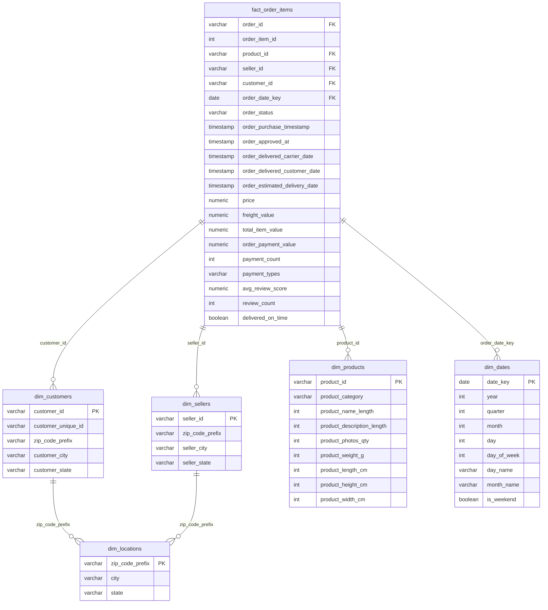

# Olist Star Schema Diagram

## Overview
This star schema transforms the Olist OLTP database (3NF) into an optimized analytical model with one fact table and five dimension tables.

## Design Decisions

| Aspect | Decision | Rationale |
|--------|----------|-----------|
| **Grain** | One row per order line item | Most granular level; supports any aggregation |
| **Fact Type** | Transaction fact table | Each row represents a business event (item sold) |
| **Date Dimension** | Generated from order timestamps | Covers only dates with actual orders |
| **Location** | Shared dimension for customers & sellers | Avoids duplication of geographic data |
| **Payments** | Aggregated to order level in fact | Payments are per-order, not per-item |
| **Reviews** | Averaged to order level in fact | Reviews are per-order, not per-item |
| **Materialization** | Dimensions & fact as tables; staging as views | Tables for query performance; views for freshness |
